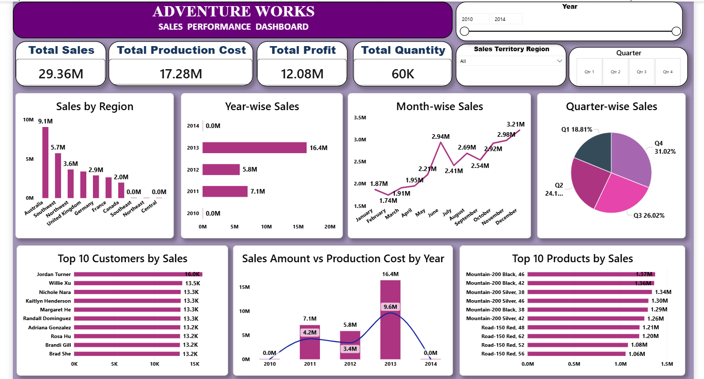
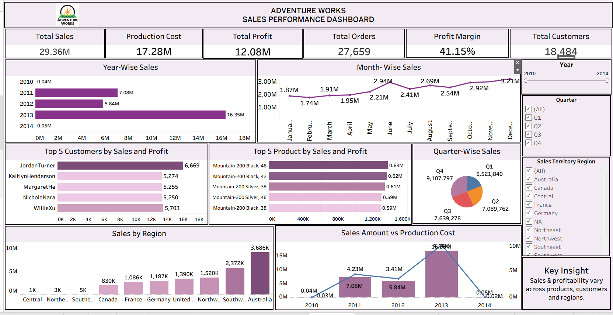

# 📊 AdventureWorks Sales Performance Analysis

## 📌 Project Overview

The **AdventureWorks Sales Performance Analysis** project is an end-to-end Data Analytics project focused on analyzing sales performance, profitability, products, customers, and regional trends.

The project uses **Excel, SQL, Power BI, and Tableau** to clean, transform, analyze, and visualize sales data and generate meaningful business insights.

## 🎯 Project Objectives

- Analyze overall sales and profit performance
- Track important business KPIs
- Identify top-performing products
- Analyze sales and profit by region
- Analyze customer and product performance
- Identify sales and profit trends
- Create interactive dashboards
- Generate data-driven business insights

## 🛠️ Tools & Technologies

| Tool | Purpose |
|------|---------|
| Excel | Data cleaning, transformation and analysis |
| SQL | Data querying and analysis |
| Power BI | Interactive dashboards and KPI visualization |
| Tableau | Data visualization and dashboard development |

## 🔄 Project Workflow

```text
Raw Data
   ↓
Data Cleaning & Transformation
   ↓
Excel + SQL Analysis
   ↓
KPI Analysis
   ↓
Power BI + Tableau Dashboards
   ↓
Business Insights
```

## 🧹 Data Preparation

The data was prepared for analysis using Excel and SQL.

### Activities Performed

- Data cleaning
- Handling missing values
- Removing duplicate records
- Data type validation
- Data transformation
- Data filtering
- Data aggregation
- Preparing data for visualization

## 🗄️ SQL Analysis

SQL was used to perform data extraction, filtering, aggregation, grouping, and analysis.

### Key Analysis

- Total Sales
- Total Profit
- Total Quantity
- Sales by Region
- Sales by Product
- Profit by Product
- Top 10 Products
- Customer Performance
- Sales Trends
- Profit Trends

### Example SQL Query

```sql
SELECT 
    SUM(SalesAmount) AS Total_Sales
FROM Sales;
```

## 📗 Excel Analysis

Excel was used for data cleaning, analysis, and business reporting.

### Excel Techniques

- Data Cleaning
- Data Transformation
- PivotTables
- PivotCharts
- Calculated Fields
- KPI Analysis
- Filtering and Sorting
- Sales Analysis
- Profit Analysis

## 📊 Power BI Dashboard

An interactive Power BI dashboard was created to analyze sales performance.

### Key KPIs

- Total Sales
- Total Profit
- Total Quantity
- Profit Margin

### Dashboard Analysis

- Sales by Region
- Sales by Product
- Profit by Product
- Top 10 Products
- Customer/Segment Analysis
- Sales Trends
- Profit Trends
- Interactive Filters and Slicers

### Power BI Dashboard



## 📈 Tableau Dashboard

A Tableau dashboard was developed for interactive sales performance analysis.

### Tableau Analysis

- Sales Performance
- Profitability Analysis
- Regional Performance
- Product Performance
- Sales Trends
- Interactive Filters

### Tableau Dashboard



## 💡 Business Analysis

The project analyzes:

- Product sales performance
- Regional sales performance
- Profitability
- Customer/segment performance
- Sales trends
- Profit trends
- Key business KPIs

## 📁 Project Structure

```text
AdventureWorks-Sales-Performance-Analysis/
│
├── README.md
│
├── Data/
│   └── AdventureWorks_Data.xlsx
│
├── SQL/
│   └── sales_analysis.sql
│
├── Excel/
│   └── AdventureWorks_Analysis.xlsx
│
├── PowerBI/
│   └── AdventureWorks_Dashboard.pbix
│
├── Tableau/
│   └── AdventureWorks_Dashboard.twbx
│
└── Screenshots/
    ├── powerbi_dashboard.png
    └── tableau_dashboard.png
```

## 📚 Skills Demonstrated

- Data Analysis
- Data Cleaning
- Data Transformation
- Exploratory Data Analysis (EDA)
- SQL
- Microsoft Excel
- Power BI
- Tableau
- Data Visualization
- Dashboard Development
- KPI Analysis
- Business Analytics
- Data Storytelling

## 🚀 Project Outcome

This project demonstrates an end-to-end **Data Analyst workflow**, from data preparation and SQL analysis to interactive dashboard development using Power BI and Tableau.

The project helped develop practical skills in:

**Data Cleaning → SQL Analysis → Excel Analysis → KPI Analysis → Data Visualization → Dashboard Development → Business Analytics**

## 👩‍💻 Author

## Sandhya Veer

**Aspiring Data Analyst**

### Skills

`Excel` `SQL` `Power BI` `Tableau` `Data Analysis`
